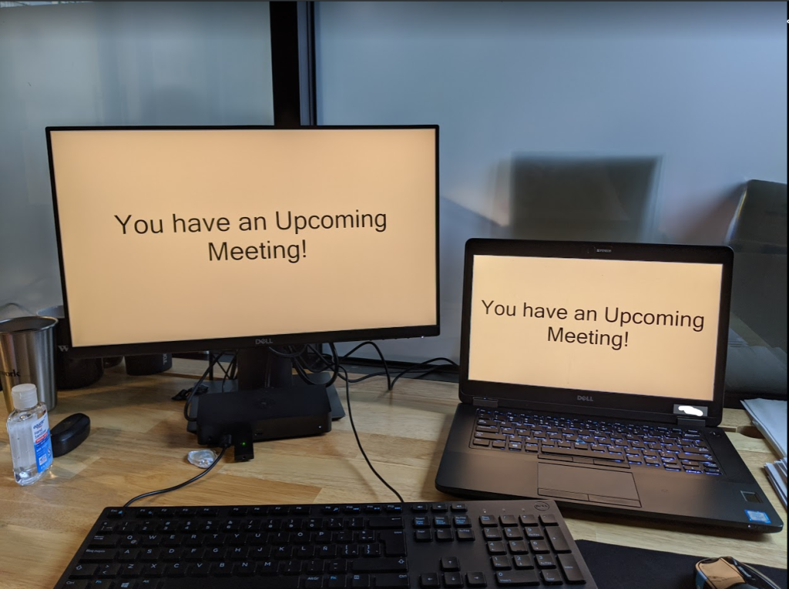

# Meeting Reminder Blackout
An annoying but effective meeting reminder that ensures you will never miss a meeting.

---

**Problem:**

1. As a Business Professional I need an effective way to remember when I have an upcoming meeting.
2. Outlook's Meeting reminders are not obtrusive or annoying enough for me to be able to remember I have a meeting.

**Solution:**
1. With the usage of some simple vba scripting and execution of an executable, I can have an annoying blackout of the entire screen any time a Outlook reminder pops up.

---



---

#  Features:
- Annoying Blackout that covers the entire screen:
  - Text is customizable
  - All Monitors are covered
  - On launch of the executable it looks to see if there are any other instances and kills them before launching itself

---

# Instructions - For Download

**Step 1:**
[Click here to Download](MeetingReminderBlackout/blob/master/MeetingReminderBlackout/bin/Release/MeetingReminderBlackout.exe).

**Step 2:**
Move the Downloaded Executable to somewhere semi-permanent (its own folder somewhere) or easy to find on your machine (not the downloads folder).

**Step 3:**
Double click and the program to test to see that it works.

---

# Instructions - For Setup in Outlook

**Step 1:**
Open Outlook, Press Alt+F11

**Step 2:**
On the left hand side, double click "This Outlook Session"

**Step 3:**
Paste the below code into the dialog that appears.

```
Private Sub Application_Reminder(ByVal Item As Object)
   Shell "C:\LocationOfExecutable\MeetingReminderBlackout.exe", vbNormalFocus
End Sub
```

---

## Authors

* **Cody Garrett** - [cody@garrett.ms](mailto:cody@garrett.ms)